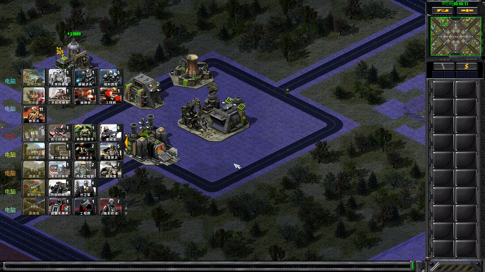

# WatchBar

红色警戒2尤里的复仇游戏内观战面板。Syringe 注入式 DLL，在对局画面上为每个玩家显示一行生产
与兵力概览。当前版本 1.3.0。



## 功能

- **在造建筑/军械**：遍历 `FactoryClass::Array`，进度用游戏的 gclock2 时钟绘制。
- **现存单位**：按类型合并计数，右上角显示数量角标；步兵 / 载具 / 飞机各自成块，
  可按类别关闭。
- **现存建筑**：可选（`WatchBar.CountBuilding`），按类型计数。
- 无 cameo 的类型整块跳过，不占格子。
- **默认仅观战者可见**：参战玩家与非对局状态下，面板和开关条（含鼠标命中框）都不
  存在。`WatchBar.SpectatorOnly=0` 可让参战者也看到面板（调布局用）。
- **被击败的玩家不再占行**，其余玩家因此获得更多行数。
- 超出可视高度的图标行不绘制，用面板底端并拢居中一对 ▲▼ 按钮整行滚动。
- 显示与隐藏由面板右侧的常驻开关条控制，也可在「选项 → 键盘」中绑定 `WatchBar`。

## 安装

| 启动方式 | 操作 |
|---|---|
| CnCNet 客户端（存在 `Resources\ClientDefinitions.ini`） | `deploy.bat --gamedir "D:\Path\to\game" --apply`；或手工在 `ExtraCommandLineParams` 中追加 `-i=WatchBar.dll` |
| Syringe 快捷方式 | 将 `WatchBar.dll` 放入游戏根目录，命令行加 `-i=WatchBar.dll` |
| 其他启动器 | 同上：让 Syringe 加载该 DLL |

`deploy.bat` 默认只做预演，加 `--apply` 才写入，并会备份 `ClientDefinitions.ini`。
`--gamedir` 是必填项，脚本不含任何内置路径。

面板没有独立的 ini 文件：参数位于 mod 自己的 `uimd.ini` 的 `[WatchBar]` 节，不写该节
时全部使用内置默认值。

## 参数

位置为 `uimd.ini` 的 `[WatchBar]` 节，键名为 `WatchBar.<键>`，每个键都有默认值。

```ini
[WatchBar]
WatchBar.TopPercent=25          ; 面板上边缘 = 10 + 视口高 × 25%
WatchBar.CellWidth=62           ; 一个 cameo 格子宽（含边框）
WatchBar.IconsPerLine=4         ; 一行放几个图标（硬上限 16）
WatchBar.MaxLinesPerPlayer=3    ; 每个玩家最多几行图标（硬上限 8）
WatchBar.LinesMode=fixed        ; fixed / compact / loose / ultra：行数是否自适应
WatchBar.SpectatorOnly=1        ; 1 = 只有观战者能看到面板
```

- 完整键表（默认值、范围、含义）：[docs/config.md](docs/config.md)。
- 可整段追加到 `uimd.ini` 的默认值块：[docs/uimd-sample.ini](docs/uimd-sample.ini)。
- 不启动游戏校验参数，并打印各分辨率下的行数表：

```bat
tools\check_ini.bat "D:\Game\Extracted\uimd.ini"
```

`uimd.ini` 由引擎在启动时读取一次，改完需重开游戏；打包在 MIX 内时用 XCC Mixer 解包、
修改后回封。无法识别的键名、越界的数字与颜色都写入 `WatchBar.log`。

`WatchBar.MaxRows` / `MaxLinesPerPlayer` / `IconsPerLine` 决定 DLL 内部数组尺寸
（编译期常量），不能改大：写入更大的值会被夹到上限并记入日志。面板内部按类型记账，
每类 64 个类型也是编译期上限，正常对局不会触及。

## 素材

格子边框、开关条与 ▲▼ 翻页按钮读取 `rulesmd.ini` 中该阵营自己的节，国旗读取国家
自己的节。五个 `WatchBar.*PCX` 都可不写，不写时面板仍可使用（格子不绘制底色、开关条
退化为横线、翻页按钮退回代码自绘的三角）；面板不推算素材名，也不读取任何其他 mod 的
侧边栏配置。键名与示例见 [docs/config.md](docs/config.md#素材rulesmdini)。

素材尺寸与 `WatchBar.CellWidth` / `CellHeight` / `ToggleWidth` / `ToggleHeight` /
`ScrollButtonWidth` / `ScrollButtonHeight` 不一致时改参数，不要让素材拉伸。

`swsideNN*.pcx` 与 `c<N>_flag.pcx` 不在本仓库内，由各 mod 自行提供。

## 统计口径

- **单位** = 地图上现存的（出厂 +1、阵亡 −1）。运输舱乘客（`InLimbo`）、正在下沉的
  船、V3/无畏的导弹、鲍里斯的支援机、侦察机、伞兵等支援单位不计。
- **建筑** = `WatchBar.CountBuilding=1` 时按类型计数（默认关闭）。只统计站在地图上
  的：围墙、激光墙、火风暴墙不计，工厂内尚未放置的不计。
- 类别的开关、块的先后、每块的格数分别由 `WatchBar.Count*`、`WatchBar.GroupOrder`、
  `WatchBar.MaxIconsPerGroup` 控制。后两项只是显示上限：被挤掉的类型仍按真实数量
  统计，只是不绘制。
- `rulesmd.ini` 中有两个可选的按类型键：`CountAs=` 把变形形态的数量并入另一类型
  （例 `[SCHD] CountAs=SCHP`），`IgnoreCount=yes` 使该类型完全不计数、不显示
  （例 `[DRONE] IgnoreCount=yes`）。两个键都不写时行为不变；跨类别的 `CountAs`
  会被拒绝。

## 从源码构建

```bat
git clone --recurse-submodules <repo>
cd WatchBar
build.bat
deploy.bat --gamedir "D:\Path\to\game"           :: 预演
deploy.bat --gamedir "D:\Path\to\game" --apply   :: 写入
```

- 需要 VS2022 C++ 工具链（Build Tools 即可）。`build.bat` 会自行查找 `vcvars32.bat`，
  也可用 `build.bat --vcvars "C:\path\to\vcvars32.bat"` 指定。
- 依赖 [YRpp](https://github.com/Phobos-developers/YRpp) 头文件（子模块 `YRpp/`）。
- 编译参数中的 `/std:c++20`、`/DNOMINMAX`、`/DSYR_VER=2` 不可删除。缺少
  `/DSYR_VER=2` 会生成能加载但钩子不生效的 DLL，`build.bat` 会在编译后检查
  `.syhks00` 节并在缺失时判定失败。

| 文件 | 内容 |
|---|---|
| `src/WatchBar.cpp` | 面板实现（绘制、收集、门控、gadget、钩子） |
| `src/Config.h` / `src/Config.cpp` | 参数结构、硬上限，以及 `uimd.ini [WatchBar]` 的解析与校验 |
| `docs/config.md` | 参数参考 |
| `docs/uimd-sample.ini` | 可整段追加到 `uimd.ini` 的默认值块 |
| `tools/check_ini.bat` | 离线参数校验 |

## 兼容性

| 环境 | 状态 |
|---|---|
| EC（Ares + Phobos，CnCNet 客户端） | 已实机验证 |
| 原生 YR 1.001 + Ares | 未测试（cameo 走 SHP 路径） |
| 原生 YR 1.001，无 Ares | 未测试（使用 `Cameo=`，`CameoPCX=` 不生效） |
| 无 swside 素材的 mod | 未测试（格子不绘制底色，cameo 直接画在战场上） |
| 修改或加壳过 `gamemd.exe` 的 mod | 不支持：钩子点是 YR 1.001 的绝对地址，启动时会比对 exe 时间戳并写 WARNING |

`CameoPCX=` 由 Ares 定义，无 Ares 时 art 里不会有这个键，面板退回引擎的 `Cameo=` SHP
路径；该键存在时由面板自己加载 PCX，不调用 Ares。运行时不依赖 Ares 或 Phobos：DLL
只读取游戏自身的 `HouseClass` / `FactoryClass` / 单位数组，不使用
`ReadProcessMemory`，不需要管理员权限。

## 已知限制

- **点击穿透**：面板绘制在战场上，落在面板上的鼠标事件会传递给下方地图。
- **鼠标滚轮不可用**：引擎在设备层处理滚轮，进程内收不到（消息钩子与 Raw Input 均
  无事件）。滚动由 ▲▼ 按钮完成。
- **字体固定**：`GAME.FNT` 未逆向，`Point8` 是已验证可正常渲染的最大字号。
- **参数不热重载**：`uimd.ini` 由引擎在启动时读取一次，修改后需重开游戏。

## 许可

[GPL-3.0](LICENSE)。

机制参考 [Phobos](https://github.com/Phobos-developers/Phobos) 的超武侧边栏
（`GadgetClass` + `GScreenClass::AddButton`）与游戏内调试面板（`ObjectInfo.cpp`，同一
绘制钩子点）；结构定义来自 [YRpp](https://github.com/Phobos-developers/YRpp)；注入
框架为 [Syringe](https://github.com/Phobos-developers/SyringeEx)。
